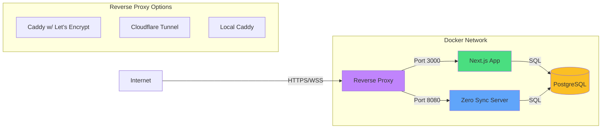

# Hoard Deployment Guide

This guide covers deploying Hoard with HTTPS/WSS support using Docker Compose. The app requires secure connections for browser features like camera access on mobile devices.

## Architecture Overview



### Components

- **Next.js App**: Main application frontend and API
- **Zero Sync Server**: Real-time data synchronization via WebSocket (using official Rocicorp image)
- **PostgreSQL**: Database used by both Next.js and Zero (with separate DBs for Zero's CVR and change tracking)
- **Reverse Proxy**: One of three options for HTTPS/WSS termination

## Quick Start

1. **Clone the repository and navigate to deploy folder**
   ```bash
   git clone https://github.com/jyecusch/hoard.git
   cd hoard/deploy
   ```

2. **Run the setup script**
   ```bash
   ./setup.sh
   ```
   The script will:
   - Create `.env` file from template
   - Generate secure secrets automatically
   - Guide you through HTTPS configuration
   - Start the services

3. **Access your application**
   - Caddy profile: `https://yourdomain.com`
   - Cloudflare profile: Check your tunnel's public hostname
   - Local profile: `https://localhost`

## HTTPS Options

We provide three deployment profiles based on your network situation:

### Option 1: Caddy with Let's Encrypt (Recommended)

**Best for:** Production deployments with a domain name

**Prerequisites:**
- Domain name pointing to your server
- Ports 80 and 443 open in firewall
- Public IP address

**Setup:**
1. Edit `.env` and set your domain:
   ```env
   DOMAIN=app.example.com
   APP_URL=https://app.example.com
   ```

2. Start with Caddy profile:
   ```bash
   docker compose --profile caddy up -d
   ```

3. Verify HTTPS is working:
   ```bash
   curl https://yourdomain.com
   ```

**Features:**
- Automatic SSL certificates from Let's Encrypt
- Auto-renewal of certificates
- HTTP to HTTPS redirect
- WebSocket proxying for Zero sync

### Option 2: Cloudflare Tunnel (No Open Ports)

**Best for:** Deployments behind firewalls or without public IPs

**Prerequisites:**
- Cloudflare account (free tier works)
- No open ports required!

**Setup:**
1. Create a Cloudflare Tunnel:
   - Go to [Cloudflare Zero Trust Dashboard](https://one.dash.cloudflare.com/)
   - Navigate to Networks → Tunnels
   - Create a new tunnel and save the token

2. Configure tunnel routing:
   - Add public hostname for your domain
   - Service: `http://app:3000`
   - Add another route for Zero WebSocket:
     - Path: `/zero/*`
     - Service: `http://zero:8080`

3. Edit `.env` and add your tunnel token:
   ```env
   TUNNEL_TOKEN=your-tunnel-token-here
   ```

4. Start with Cloudflare profile:
   ```bash
   docker compose --profile cloudflare up -d
   ```

**Features:**
- No open ports needed
- DDoS protection included
- Works behind NAT/firewalls
- Global CDN included

### Option 3: Local HTTPS (Development/Testing)

**Best for:** Local testing or internal networks

**Prerequisites:**
- None - works out of the box

**Setup:**
1. Start with local profile:
   ```bash
   docker compose --profile local up -d
   ```

2. Access at `https://localhost`

3. Accept the self-signed certificate warning in your browser

**Features:**
- Self-signed certificates (browser warning expected)
- No domain needed
- Perfect for testing HTTPS features locally

## Environment Variables

Key environment variables in `.env`:

```env
# Database
POSTGRES_PASSWORD=changeme      # Change in production!
POSTGRES_DB=hoard
POSTGRES_USER=postgres

# Security (auto-generated by setup.sh)
BETTER_AUTH_SECRET=<32-char-secret>
JWT_SECRET=<32-char-secret>

# Profile-specific
DOMAIN=yourdomain.com           # For Caddy profile
TUNNEL_TOKEN=<cloudflare-token> # For Cloudflare profile
APP_URL=https://yourdomain.com  # Application URL
```

## Common Commands

### View logs
```bash
# All services
docker compose --profile <profile> logs -f

# Specific service
docker compose --profile <profile> logs -f app
```

### Stop services
```bash
docker compose --profile <profile> down
```

### Restart services
```bash
docker compose --profile <profile> restart
```

### Update and rebuild
```bash
git pull
docker compose --profile <profile> build
docker compose --profile <profile> up -d
```

### Database backup
```bash
docker compose exec postgres pg_dump -U postgres hoard > backup.sql
```

### Database restore
```bash
docker compose exec -T postgres psql -U postgres hoard < backup.sql
```

## Customization

### Override Settings

Create `docker-compose.override.yml` from the example:
```bash
cp docker-compose.override.yml.example docker-compose.override.yml
```

Edit to add custom configurations without modifying the main compose file.

### Custom Domain with Cloudflare

If using Cloudflare Tunnel with a custom domain:
1. Add CNAME record pointing to your tunnel subdomain
2. Configure the tunnel's public hostname in Zero Trust dashboard
3. Update `APP_URL` in `.env`

## Troubleshooting

### Port 80/443 Already in Use

If you see "bind: address already in use":
```bash
# Check what's using the ports
sudo lsof -i :80
sudo lsof -i :443

# Stop conflicting services or change ports in docker-compose.yml
```

### Let's Encrypt Rate Limits

If certificate generation fails:
- Let's Encrypt has rate limits (50 certificates per domain per week)
- Use the `local` profile for testing
- Wait if you've hit the limit

### Certificate Warnings (Local Profile)

This is expected with self-signed certificates:
1. Click "Advanced" in browser
2. Click "Proceed to localhost (unsafe)"
3. The warning only appears once per browser

### WebSocket Connection Issues

If Zero sync isn't working:
1. Check browser console for WebSocket errors
2. Ensure `/zero/*` routes are properly configured
3. Verify `NEXT_PUBLIC_ZERO_SERVER` environment variable
4. Check Zero server logs: `docker compose logs zero`

### Database Connection Issues

```bash
# Check if PostgreSQL is running
docker compose ps postgres

# Test connection
docker compose exec postgres psql -U postgres -d hoard -c "SELECT 1"

# Check logs
docker compose logs postgres
```

### Permission Issues with Uploads

```bash
# Fix upload directory permissions
docker compose exec app chown -R nextjs:nodejs /app/uploads
```

## Security Considerations

1. **Change default passwords** in `.env` before deploying
2. **Use strong secrets** - the setup script generates these automatically
3. **Keep software updated** - regularly pull and rebuild images
4. **Backup your data** - especially the PostgreSQL volume
5. **Monitor logs** for suspicious activity
6. **Use firewall rules** to restrict access if needed

## Performance Tuning

### PostgreSQL Optimization

Add to `docker-compose.override.yml`:
```yaml
services:
  postgres:
    command:
      - postgres
      - -c
      - wal_level=logical
      - -c
      - max_connections=200
      - -c
      - shared_buffers=256MB
```

### Resource Limits

Add to `docker-compose.override.yml`:
```yaml
services:
  app:
    deploy:
      resources:
        limits:
          cpus: '2'
          memory: 2G
```

## Monitoring

### Health Checks

The deployment includes health checks for critical services:
- PostgreSQL: Connection availability
- App & Zero: Add custom health endpoints

### Logs

Configure log rotation in `docker-compose.override.yml`:
```yaml
services:
  app:
    logging:
      driver: "json-file"
      options:
        max-size: "10m"
        max-file: "3"
```

## Support

For issues or questions:
1. Check the logs first: `docker compose logs`
2. Review this troubleshooting guide
3. Check GitHub issues
4. Create a new issue with:
   - Deployment profile used
   - Error messages from logs
   - Environment details (OS, Docker version)

## License

See main repository LICENSE file.